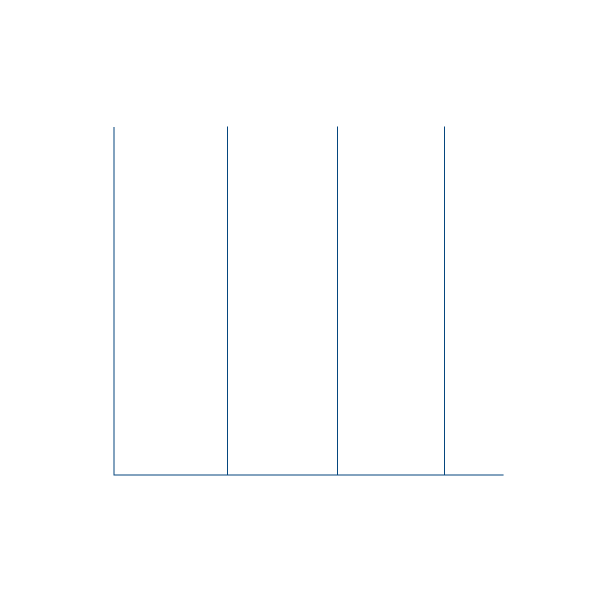

##Hi There!, I'm Muhammad Ihsan Maulana 

### You Can Connect with Me in :

    

<h2 align="center">&nbsp;&nbsp;<b>About me</b></h2>

#### Hello I'm Muhammad Ihsan Maulana. I'm a Junior Website developer with the ability to analyze and create logic for a website application program
- 🎓 I am a fresh graduate from SMK Negeri 17 Jakarta
- 🖥️ I am very interested in website development
- 🤖 I am also interested in the development of artificial intelligence
- 👨🏻‍💻 Really like code, logic and problem solving 

   

<h2 align="center">&nbsp;&nbsp;<b>Skills</b></h2>

 

- **Language**

   
   
   

- **Website & Framework**

   
   
   
   
   
   
   
   
   

- **Database**

   
   

- **Software & Tools**

   
   
   
   
   

- **IDE**

   
   
   

   

<h2 align="center"><b> Github Stats </b></h2>

   

## Profile Visits

